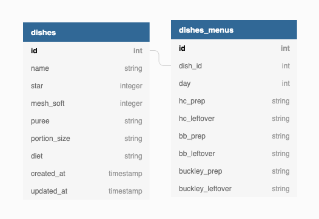

# README #

Hi folks! Current deployment: https://mayflower-dining-staging.herokuapp.com

##  Overview of the project files ##

We begin by looking over what lives where in our project.

Open up the file config/routes.rb: it contains the endpoints that
are exposed in our app.
They are divided into 3 logical components: menu, dishes and ingredients.
One the request hits one of those endpoints, it is passed to appropriate controller.

Go to app/ folder. You can find controllers/ directory there. It contains the code that decides
what happens with a given request: it talks to the database via Models and renders views.

In app/ folder, see models/ directory. It contains some of the functionality related to databases.
More on the schema will be later.

In app/ folder look at views/. It has one important view: menu/menu.html.erb. It is what is shown to the user.

Finally, assets/ folder contains static filer and css style sheets.

These are the main pieces of the app: request hits the routes, goes to controllers, they ask models for data,
and render the view.

## Database ##

Here is a diagram of the current database.



Here is a detailed explanation of each table and its content.

### 1. Dishes ###
Has the dishes. Each dish should only appear once in here. Has a one to many relationship with entires in dishes_menus.
1. id: dish id. Auto-incremented.
2. name: dish name.
3. star: 0-3. 0 for no star. 1 for \*. 2 for \*\*. 3 for \*/\*\*. The number of stars represents which, if any, special menus (for people who can't choose their own meals, or otherwise) a dish is on. 0 stars indicate it is on no special menus, 1 star for the dinner (lunch) special menu, 2 stars for the supper (dinner) special menu and 3 stars for both dinner and supper special menus.
4. mesh_soft: 0-2. 0 for none. 1 for Flaked. 2 for Ground.
5. puree: number of puree servings and puree texture.
6. portion_size: portion size of the dish.
7. diet: portion size for diet.
### 2. Dishes_Menus ###
Each entry contains information for one dish on one certain day / menu (0 - 48, a 7-week cycle).
1. id: dish_menu id. Auto-incremented.
2. dish_id: the dish whose information is contained in this entry.
3. day: the index of the menu (0-48) in a 7-week cycle.
4. hc_prep: the prepared amount for dining location hc.
5. hc_leftover: the leftover amount for dining location hc.
6. bb_prep: the prepared amount for dining location hc.
5. bb_leftover: the leftover amount for dining location hc.
4. buckley_prep: the prepared amount for dining location hc.
5. buckley_leftover: the leftover amount for dining location hc.

## Models ##

The models directly interact with the DB and selectively implement CRUD (create, read, update, delete) for security reason.
### 1. Dish ###
1. Create: use add_dish. Name is required. Other default values are star:0, mesh_soft:0, puree:"", portion_size:"", diet:"". Raises an exception if the dish already exists.
2. Read: use get_dish. Works by either id or name. The method automatically checks the query type. Raises an exception if the dish with that name does not exist.
3. Update: use update_dish. Original name is required, followed by any attributes you want to update. Allowed attributes: new_name, star, mesh_soft, puree, portion_size, diet. 
4. Destroy: use remove_dish. Raises an exception if the dish you specified does not exist or there is a menu connection with this dish in it (meaning you have to first remove this dish from menus before being able to delete the dish just for caution).

### 2. Dishes_Menus ###
1. Create: use add_dish_to_cycle. Takes a day and a dish name.
2. Read: use get_by_day if you want to get dishes of a day, and get_by_day_and_dish if you want to get a specific entry.
3. Update: use update_dish_menu. Day and name are required arguments, followed by any parameters you want update: hc_prep, hc_leftover, bb_prep, bb_leftover, buckley_prep, buckley_leftover. Can only be used to update prep and leftover.
4. Destroy: use remove_dish_from_cycle. Takes a day and a dish name.

## Controllers, routes and view ##

We aimed at being as concise as possible in terms of the number of views that we have, in order to prevent the user
from having to browse through multiple pages to do one thing. Therefore, the idea is that the menu.html.erb file
is used to display menu for any date, as well as add/remove dishes to the menu, and possibly create new dishes and ingredients.

Menu controller has two functions: one displays the menu for a given date, and another one edits the menu.
Dishes controller contains endpoints that create/update/destroy existing dishes.
Ingredients controller contains endpoints that create/update/destroy existing ingredients.

So as much logic as possible is dealt with on the front end of the main page to avoid creating too many unnecessary views. We were hoping to be sending post requests from the menu page to the controllers above, so that everything is managed from one page. We didn't exactly finish the full implementation of that, so its on you.

## Setup ##

Open up the file config/database.yml. It contains the information about what database setup needs to be in place
for your development environment. So you need to create a postgresql database, name it mayflower_dev, and set username and password as specified in the file. For Mac users, it is recommended to use pgadmin4 to manage database easily.

Then install gems by running

```
bundle install
```

Then seed the database with the data provided by Scott

```
rails db:seed
```

Then run the server

```
rails s
```

If these steps did not work for you, please look in the file `setup.txt` for more explicit steps that we had to follow in order to get started.

## Honorable mentions ##

Procfile is the file that runs release-setup.sh file everytime the app is pushed to Heroku. Then, you don't have to manually run migrations and seed on the database. Edit release-setup.sh, if you want other stuff to happen on deployment.

db/menus contains the tables of mayflower menu that Scott gave us. db:seed uses this data right now.

db/seeds.rb is what takes db/menus and sends that data to the database.

db/migrate contains migrations. NOTE: MIGRATIONS ARE APPEND ONLY. So, if you add anything to the database via migraitons, do not edit existing ones but create new file for each change you make. Otherwise, you will have incompatible migrations on different machines, and it means suffering.

## Deployments ##

The app is currently deployed to heroku.

Install heroku CLI: https://devcenter.heroku.com/articles/heroku-cli#download-and-install

```
heroku login
```

Then once you want to push the new feature to production, do

```
git push <Your heroku repo found under Settings on heroku dashboard> master
```

## Future work ##

1. Finish hooking up the menu page to the controllers properly (there are a number of bugs and errors right now).
2. Creating to-do lists for the recipes.
3. Figure out how to deal with ingredients.
4. Connect recipe to do list to ingredient inventory.
5. Add a page for users to edit dishes and ingredients.
6. Add special menus: Thanksgiving, 4th of July, etc.
